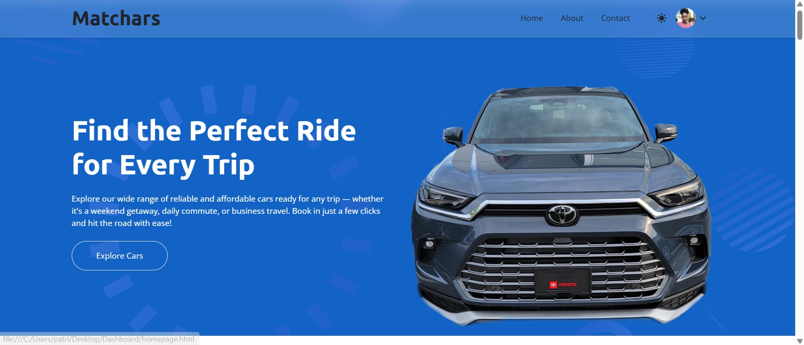
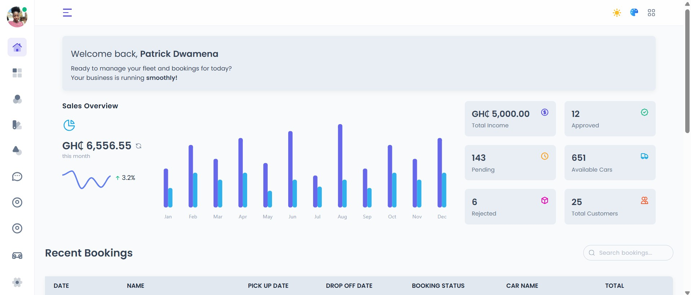
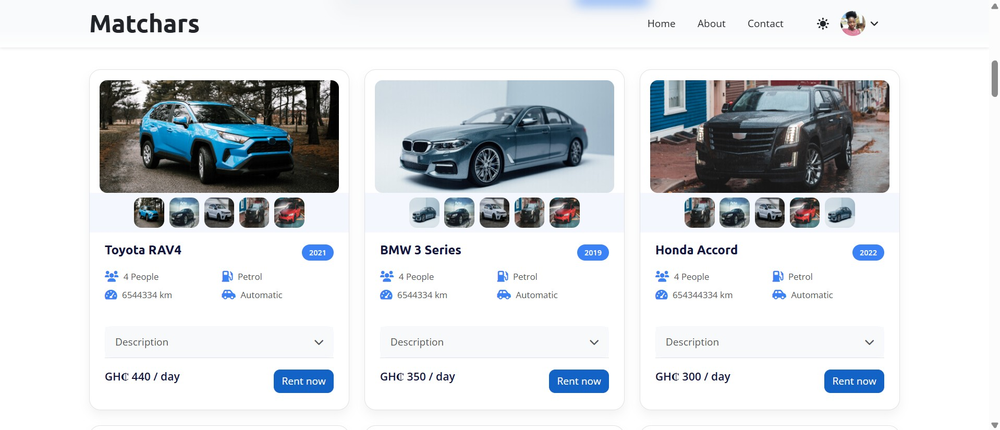
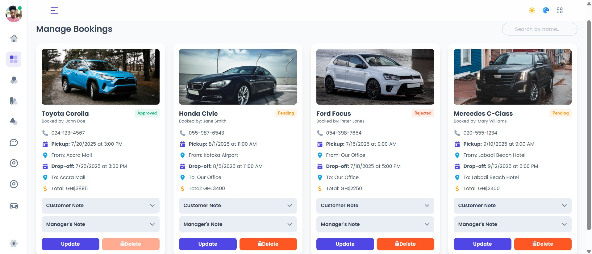
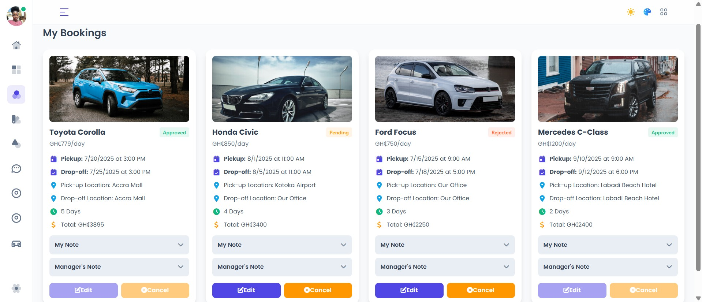
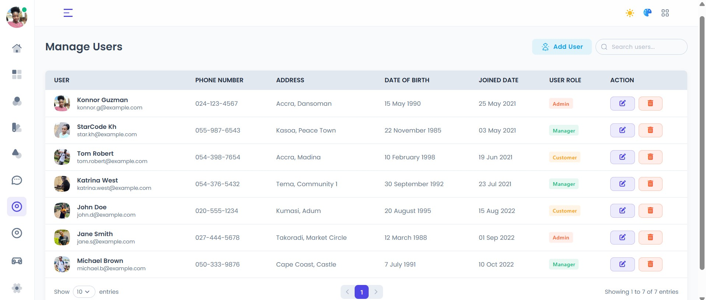
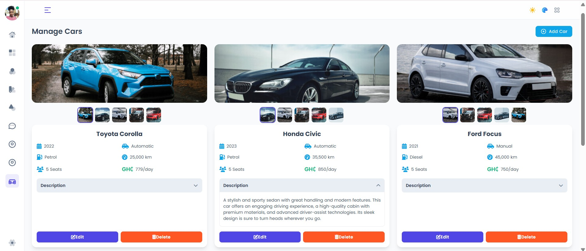
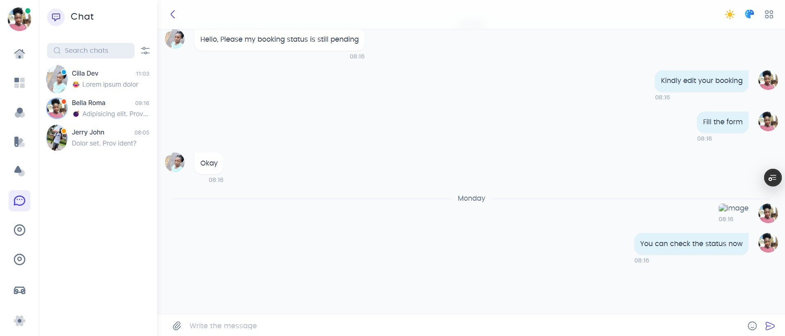
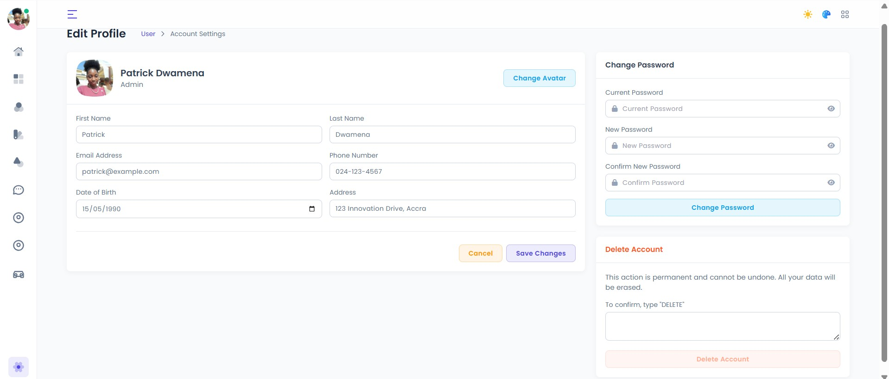
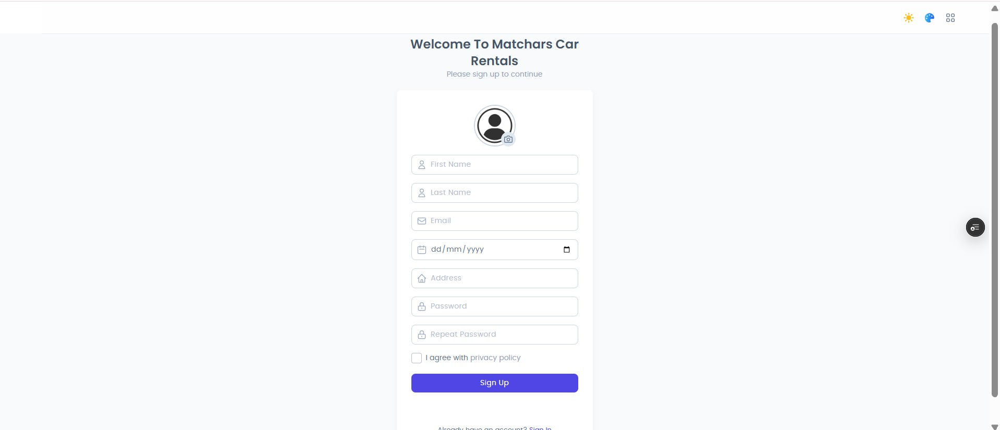

# 🚗 Matchars Car Rental System

[🌐 Demo Site](https://matchars-car-rental.vercel.app)  
[📦 GitHub Repository](https://github.com/MrCoolGh/MatcharsCarRental)

## 📌 Project Overview

**Matchars Car Rental System** is a web-based application designed to streamline the process of renting vehicles. Developed as part of the **DCIT 208 – Software Engineering** course at the **University of Ghana**, this project involves delivering a real software solution to a real-world client.

The system offers users the ability to view available cars, register, make bookings, and receive confirmations, while admins can manage cars, customers, and rental data securely.

## 🎯 Key Features

- 🚘 View available cars and details
- 🧾 Book a car online with date & time selections
- 👤 User registration and authentication
- 📊 Admin dashboard to manage bookings, users, and vehicles
- 🛡️ Security and database best practices

## 🛠️ Tech Stack

- **Frontend:** HTML, CSS, Bootstrap  
- **Backend:** Laravel (PHP Framework)  
- **Database:** MySQL  
- **Deployment:** Not yet 
- **Tools Used:** Git, GitHub, VS Code, Figma, IntelliJ

## 👥 Team Members

| Name                   | Role                     |
|------------------------|--------------------------|
| Dwamena Patrick        | Full-Stack Developer / Project Manager |
| Richardson Jerry John | DevOps Engineer          |
| Isabella Baapogma     | Frontend Developer       |
| Priscilla Mankoe      | UI/UX Designer           |
| Acquah Stephen         | Backend Developer        |
| Michael Hodor          | Security Engineer        |
| Edwige Gbassi          | Database Engineer        |

## 📸 Screenshots

### 1. 🏠 Home Page  

### 2. ⚙️ Admin And Customer Dashboard

### 3. 🚘 Car Listings  

### 4. 📅 Manage Bookings  

### 5. 🧾 My Bookings (User View)  

### 6. 👥 Manage Users  

### 7. 🚘 Manage Cars  

### 8. 💬 In-App Chat  

### 9. ✏️ Edit Profile  

### 10. 👤 User Registration  

### 11. 🔐 Login Page  

## 📄 License
This project is for educational purposes under the DCIT 208 course and is not licensed for commercial use at this time.

